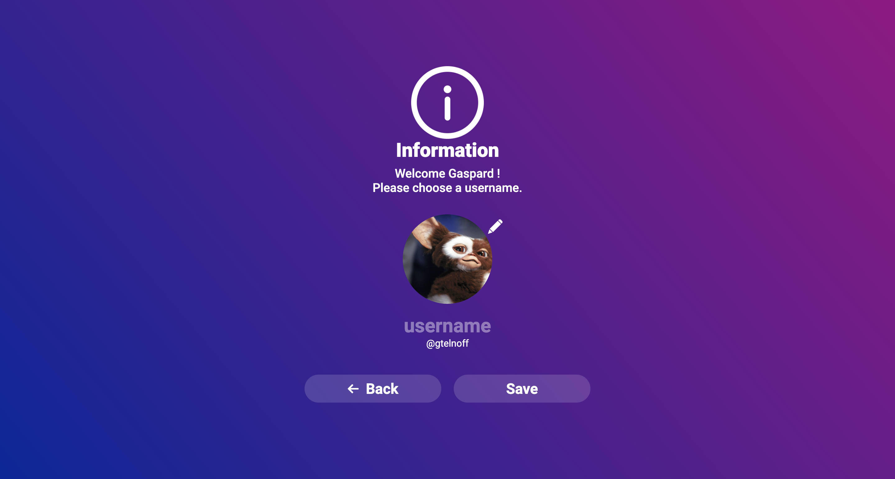
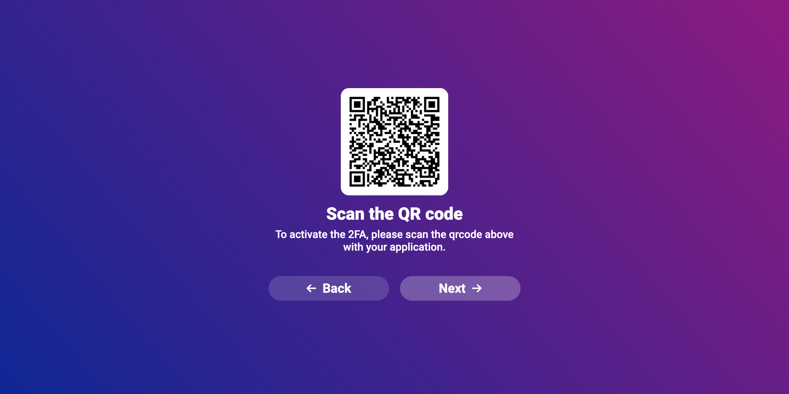
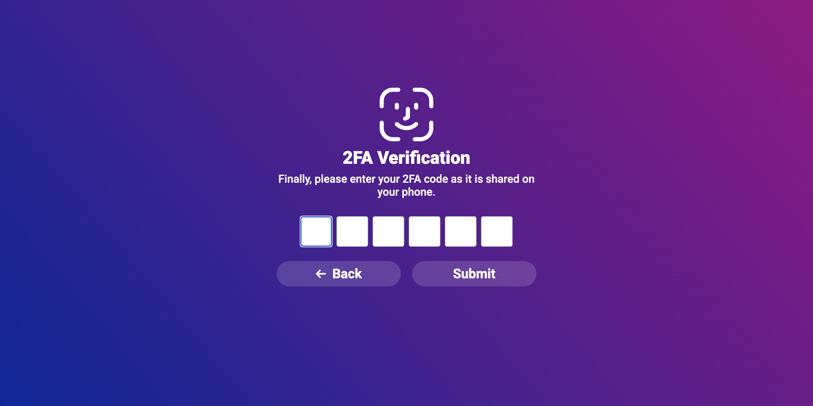
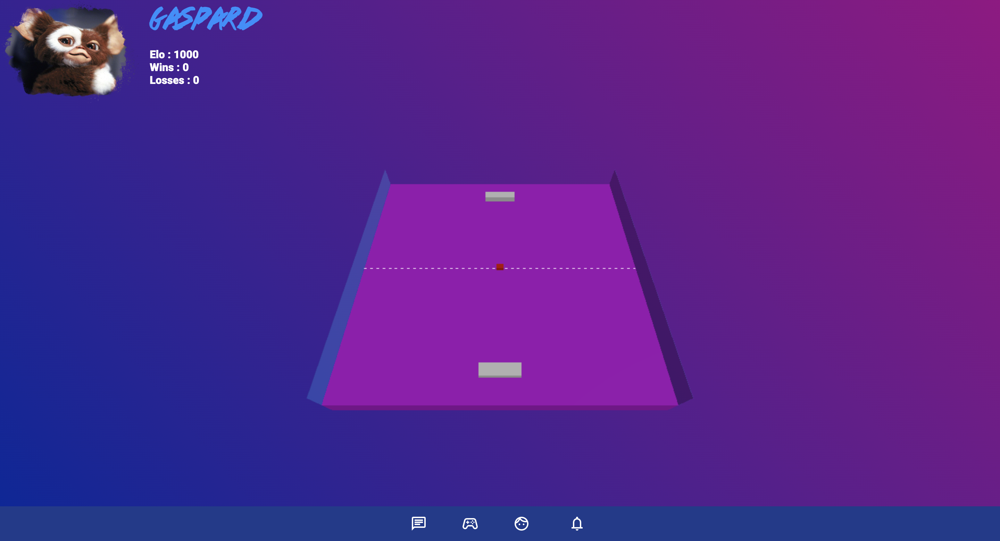
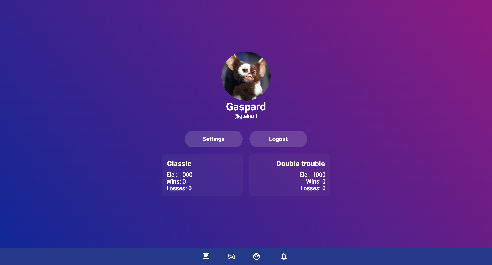
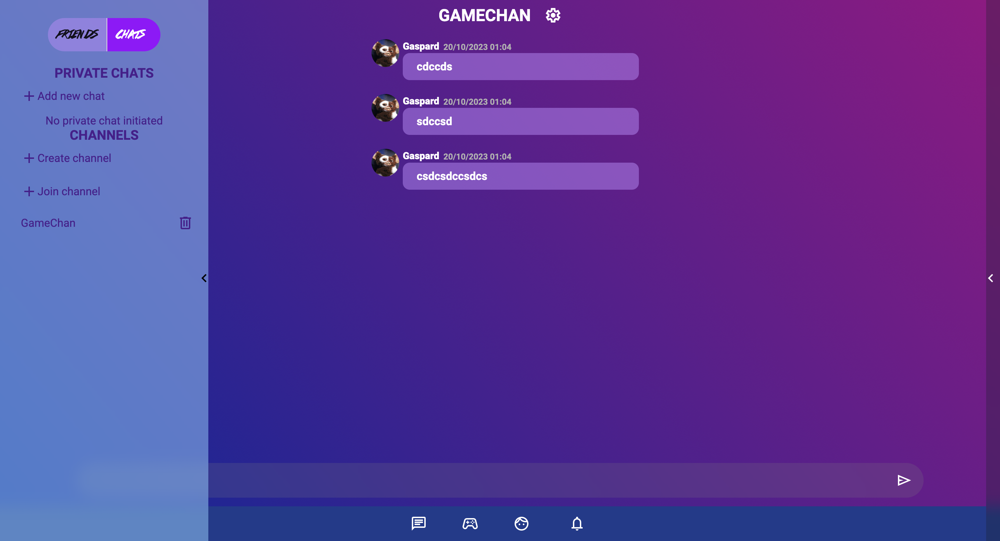

<h1>ft_transcendence</h1>
<h2>Presentation 📝</h2>
This is my final project of the common core at 42, done with <b>dguet</b>, <b>johroberet</b>, and <b>pmailly</b>.  
The concept is simple, developing <b>multiplayer Pong</b> on a website from scratch. 
<h2>Technologies used ⚡ </h2> 
<b>Frontend</b>: Angular, <b>Backend</b>: NestJs, <b>Database</b>: PostgreSQL, <b>JWT</b>: ID token, <b>42API</b>: authentication, <b>socket.io</b>: game, chat, and notifications.
<h1>Rendering</h1>

